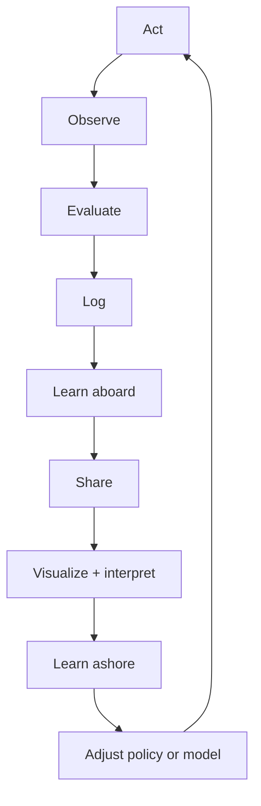

## The missing architecture: AOELL, share, learn, adjust

At this stage, turtleOS should not be described as a finished navigation controller. It is an instrumented sailing experiment that acts, observes the consequences, evaluates what happened, records enough context to explain it, and gradually learns how this particular turtle responds.

We will call the onboard cycle **AOELL**:

1. **Act**
2. **Observe**
3. **Evaluate**
4. **Log**
5. **Learn**

Act comes first because every cycle begins with an intentional action. That action may be to wake the sensors, hold the current sail angle, make a bounded sail adjustment, perform a luff sweep, feather the sail, or enter a safety state. Observing is indeed an act in the broader philosophical sense, but in the code it is useful to distinguish the command from the measurements that follow it.

AOELL is not complete when the turtle has updated its own working state. The records must be shared with a shore-side system where the team and later machine-learning processes can replay the voyage, compare intention with reality, identify patterns, and approve improved policies. The complete architecture is therefore:

In compact form:

> **AOELL → Share → Visualize and interpret → Learn → Adjust → AOELL again**

This makes turtleOS and hopeTurtles.org two parts of one learning system:

- **turtleOS** conducts bounded experiments, protects the turtle, and produces scientifically useful records.
- **hopeTurtles.org** receives those records, reconstructs what happened, supports human interpretation, trains and tests models, and distributes approved improvements.

The early goal is not to let a turtle freely rewrite its own navigation logic at sea. The goal is to make every voyage—and especially every failure—produce evidence that can improve the next decision, policy version, and turtle.

### AOELL is a causal episode, not merely a software loop

Each AOELL cycle must preserve the relationship between one action and the observations that follow it. If sensor packets, sail commands, and GPS points are stored as unrelated time series, the team may see where the turtle went but cannot reliably explain why.

The cycle should have a unique `cycle_id` generated aboard. It should refer to:

- the mission and turtle;
- the prior cycle and prior learned state;
- the action selected;
- why it was selected;
- what turtleOS predicted;
- what was observed afterward;
- how the result was evaluated;
- what was learned or updated;
- the firmware, policy, model, and configuration versions in force.

The action in one cycle is normally chosen using the learned state and observations retained from previous cycles. The first action after boot may simply be `SENSE_AND_BASELINE`, which activates the sensors and establishes the initial state.

### 1. Act

An action must be explicit even when the turtle does not move the sail. Initial action types should include:

- `SENSE_AND_BASELINE`
- `HOLD_SAIL`
- `SET_SAIL_ANGLE`
- `EXPLORATORY_SAIL_STEP`
- `LUFF_SWEEP`
- `RESTORE_PREVIOUS_ANGLE`
- `FEATHER_SAIL`
- `ENTER_SAFE_MODE`
- `SLEEP_OR_REDUCE_SAMPLING`

Recording `HOLD_SAIL` is particularly important. Hold periods provide control cases against which sail changes can be compared. A dataset containing only interventions will make it difficult to distinguish the effect of an action from current, waves, or an environmental change that would have occurred anyway.

Before execution, turtleOS should record:

- the trigger and decision rule;
- the previous and commanded sail angles;
- whether the action is observational, exploratory, corrective, or safety-related;
- the intended outcome;
- predicted direction and approximate magnitude of response;
- planned evaluation horizons;
- relevant confidence scores;
- battery and safety constraints;
- whether a candidate action was rejected and why.

The first policies should choose sparse, bounded actions. Sensor sampling can be frequent during an experiment, but sail movement should be reluctant and followed by a long enough hold period to measure its consequences.

### 2. Observe

Observation should be concentrated around the action rather than running every sensor continuously at its highest rate for the entire voyage.

For each cycle, turtleOS should retain a pre-action baseline and post-action measurements including:

- GPS position, fix quality, speed over ground, and course over ground;
- fused heading and heading confidence;
- roll, pitch, heel, turn rate, and motion variability;
- commanded sail angle and actual AS5600 sail angle;
- luff-derived wind estimate and its confidence;
- bearing and distance to the active waypoint;
- cross-track error and velocity made good toward the waypoint;
- battery voltage, current, estimated state, and action energy cost;
- servo movement time, tracking error, obstruction, or stall indicators;
- navigation state, safety flags, and data-quality flags.

Short high-rate buffers should be saved around luff sweeps, sail movements, spins, stalls, and other anomalies. Routine periods can be reduced to summary statistics. This preserves the interesting dynamics without filling storage and exhausting the battery with an ocean of redundant samples.

### 3. Evaluate

Each action should be evaluated at more than one horizon. Initial trial values might be:

- **30 seconds:** immediate turn and motion response;
- **120 seconds:** course and speed response;
- **300 seconds:** meaningful change in waypoint progress.

These horizons must remain configurable and should eventually be tuned from trial data.

The primary outcome is not simply whether compass heading moved toward the waypoint. With a fixed rudder, current, leeway, and a sail as the only actuator, the turtle may point one way and travel another. Evaluation should include:

- change in course over ground;
- accumulated turn and mean turn rate;
- change in speed over ground;
- change in velocity made good;
- change in cross-track error;
- motion stability;
- energy used;
- whether the commanded sail position was actually reached;
- whether the predicted response occurred;
- whether the action improved the mission objective;
- whether the available evidence was good enough to judge the action.

Outcomes should support at least:

- `SUCCESS`
- `MIXED`
- `FAILURE`
- `NO_MEASURABLE_EFFECT`
- `NOT_EVALUABLE`

`NOT_EVALUABLE` is not failure. A lost GPS fix, an interrupted observation window, or severe wave disturbance must not be turned into a false training label.

Evaluation also needs a baseline. Where possible, the system should compare the post-action period with the preceding hold period and with comparable historical hold periods. This will not fully prove causation, but it is far stronger than assuming that every change after a command was caused by the command.

### 4. Log

The log must record the turtle's reasoning, not merely its sensor readings. Every cycle should answer:

1. What action did the turtle take?
2. What did it believe before acting?
3. Why did it choose that action?
4. What did it predict would happen?
5. What did it observe?
6. How did it score the result?
7. What did it update afterward?

Logs should be written locally first. Each record should have a device-generated UUID or monotonic identifier and a millisecond-resolution event timestamp. Upload must be idempotent so the same stashed batch can be retransmitted safely without creating duplicates.

The existing `telemetry_readings_tb` remains useful for ordinary sensor samples, including its `values_json`, `confidence_json`, `flags_json`, GPS fields, and separate device and server timestamps. It should not, however, carry the entire causal history by itself.

The current `UNIQUE (device_id, recorded_at)` constraint and whole-second `DATETIME` timestamp are insufficient for multiple events in the same second. AOELL records should use millisecond timestamps such as `DATETIME(3)` and a device-generated event identifier.

### 5. Learn aboard

Initially, onboard learning should be modest and inspectable. It may:

- update confidence in the current luff-derived wind estimate;
- update a small empirical response table;
- remember which sail adjustments recently helped or harmed waypoint progress;
- estimate action reliability under the current motion state;
- detect that current conditions fall outside previously observed experience;
- lengthen observation periods when results are noisy;
- reduce exploration when battery, safety, or sensor confidence is poor.

The first turtle should not silently retrain a complex model and replace its own policy at sea. Early onboard learning should update bounded state within a versioned policy. All changes must be logged and reversible.

Separate confidence scores should include:

- `gps_position_confidence`
- `gps_course_confidence`
- `heading_confidence`
- `sail_angle_confidence`
- `luff_wind_confidence`
- `motion_stability`
- `action_execution_confidence`
- `outcome_evaluation_confidence`
- `model_applicability_confidence`

The final score is never more trustworthy than the evidence from which it was derived. The visualizer must show these uncertainties rather than hiding them behind a single cheerful green number.

## Sharing stashed telemetry and AOELL cycles

Connectivity must be treated as intermittent. turtleOS should maintain an append-only local queue containing:

- routine telemetry summaries;
- AOELL cycle records;
- evaluation records at each horizon;
- short high-rate event buffers;
- fault and recovery events;
- configuration, firmware, policy, and model metadata.

Each upload batch should include:

- `device_uid`
- `mission_id`
- `batch_id`
- first and last sequence numbers;
- first and last device timestamps;
- record count;
- payload checksum;
- schema version.

The server acknowledges the highest contiguous sequence received. The turtle retains unacknowledged records and retries later. Records are ordered by device event time for replay, while `received_at` remains available to show when the server actually obtained them. A week of delayed telemetry must appear in the week-old portion of the voyage, not suddenly masquerade as live navigation.

For the existing Express/MySQL backend, suitable device-authenticated endpoints would be:

- `POST /api/v1/telemetry/batch`
- `POST /api/v1/aoell/batch`
- `GET /api/v1/policy/manifest`
- `GET /api/v1/policy/:version`
- `POST /api/v1/policy/:version/ack`

Policy download must be authenticated, checksummed, versioned, and capable of rollback. The turtle should never execute a partly downloaded or incompatible policy.

## Server-side data model

The existing hopeturtle_db database is a useful base, but the navigation system needs explicit mission and experiment records. Please evaluate whether the following tables need amendment or addition to the current schema....

| Table | Purpose |
| --- | --- |
| `missions_tb` | Mission identity, turtle, start/end times, origin, destination, status, and active policy |
| `mission_waypoints_tb` | Ordered waypoints, arrival radii, desired corridor, and waypoint type |
| `aoell_cycles_tb` | One record per onboard cycle: action, reason, prediction, prior state, and versions |
| `aoell_evaluations_tb` | One-to-many evaluation horizons and measured outcomes linked to a cycle |
| `aoell_observations_tb` | Links or summaries for pre-action and post-action observation windows |
| `mission_annotations_tb` | Human notes, labels, explanations, and reviewed outcome overrides |
| `policy_versions_tb` | Versioned rules, limits, feature definitions, configuration, and deployment status |
| `model_versions_tb` | Training dataset, features, metrics, applicability limits, and model artifact metadata |
| `device_policy_deployments_tb` | Which turtle received, acknowledged, activated, or rolled back each version |
| `upload_batches_tb` | Idempotent ingestion, checksums, sequence ranges, and completeness |

High-volume sensor data can remain in `telemetry_readings_tb`, preferably with millisecond timestamps and an optional mission identifier. AOELL tables should point to relevant telemetry time ranges rather than copying every IMU sample into every cycle.

JSON is useful for evolving experimental features, but frequently filtered fields—mission, cycle, action type, timestamp, policy version, outcome, and key navigation metrics—should be normal indexed columns. Burying everything in JSON would make later analysis unnecessarily slow and awkward.

## The hopeTurtles.org AOELL visualizer

The AOELL visualizer should be a dedicated authenticated mission-analysis page on hopeTurtles.org. The supplied stack identifies the frontend as **EJS + TailwindCSS**, not Vue.js. The first implementation can therefore be an EJS page enhanced with client-side JavaScript, map, and chart components. If Vue is already used elsewhere on the deployed site, the same interface can be mounted as a Vue view or isolated Vue component; the API and data model should not depend on that frontend choice.

Express should provide session-authenticated analysis endpoints, MySQL should provide indexed mission and cycle queries, and Socket.io should announce newly received batches and evaluations. Socket.io is a delivery aid, not the source of truth; replay and historical analysis must always come from the database.

### The mission map

The central map should distinguish four concepts:

- **Actual:** GPS track recorded by the turtle.
- **Intended:** planned route, active waypoint, destination, and permitted corridor.
- **Predicted:** course, turn, or position turtleOS predicted would follow an action.
- **Evaluated:** the actual position or movement observed at each evaluation horizon.

An “attempted GPS position” is better represented as a predicted point, line, or uncertainty ellipse at a named horizon. A hoped-for position is the mission intention. Keeping these distinct lets the team diagnose three very different problems:

- the policy chose the wrong objective;
- the response model made a poor prediction;
- the action was sensible but execution or environmental conditions defeated it.

Map layers should include:

- actual GPS track coloured by time, speed, VMG, action, or confidence;
- planned route, waypoint sequence, arrival circles, geofences, and hazards;
- action markers for holds, sail steps, luff sweeps, feathers, and safety events;
- predicted post-action path or position and uncertainty;
- actual post-action path at 30-, 120-, and 300-second horizons;
- lines or vectors showing prediction error;
- periods of missing GPS, delayed upload, poor confidence, or unevaluable outcomes;
- optional retrospective wind, wave, and current context, clearly labelled as shore-side external data.

The map should support a time scrubber. Moving the scrubber should update every other panel to the same moment and AOELL cycle.

### The synchronized voyage timeline

Below or beside the map, the visualizer should align:

- commanded and measured sail angle;
- luff-wind estimate and confidence;
- heading and course over ground;
- speed and VMG;
- cross-track error and waypoint distance;
- turn rate, heel, and motion stability;
- battery voltage, current, and action energy;
- GPS and sensor confidence;
- navigation state and action markers;
- policy or configuration changes;
- telemetry gaps and upload times.

This synchronization is critical. A collection of unrelated charts forces the team to reconstruct causality by eye and invites incorrect conclusions.

### The AOELL cycle inspector

Clicking any map marker or timeline action should open a complete cycle record:

- previous learned state;
- action and trigger;
- alternatives considered or rejected;
- observation baseline;
- predicted response;
- commanded versus actual sail movement;
- post-action observations;
- evaluation at each horizon;
- success label and evaluation confidence;
- onboard learning update;
- firmware, policy, model, and configuration versions;
- raw telemetry excerpt;
- team annotations and review status.

The interface should allow a reviewer to mark an evaluation as confirmed, questionable, incorrectly labelled, or not evaluable, while preserving the original machine result in an audit trail.

### Comparison and sense-making views

The team will also need views that aggregate many cycles:

- response by starting sail angle and adjustment size;
- clockwise versus anticlockwise response probability;
- response grouped by luff-relative wind angle;
- VMG and speed changes by action;
- energy cost per successful correction;
- success rate by confidence band;
- prediction calibration: 70% confidence should succeed roughly 70% of the time;
- luff-sweep repeatability and disagreement between outward and return sweeps;
- action outcome by turtle, hull configuration, firmware, policy, and model;
- hold periods versus intervention periods;
- failure and `NOT_EVALUABLE` reasons;
- sensor, servo, and policy anomalies;
- model performance on missions it was not trained on.

Filters should make it possible to compare one turtle with itself before and after an update, and to compare different turtles without pretending they are mechanically identical.

### Human interpretation is part of the learning loop

The visualizer is not merely a pretty dashboard. It is a scientific notebook and review system. Team members should be able to:

- annotate a voyage segment;
- identify external events such as handling, launch, recovery, collision, or exceptional weather;
- link photos and field notes;
- flag sensor or actuator faults;
- correct or qualify automated labels;
- select cycles for a training dataset;
- exclude corrupted or confounded cycles;
- compare policy versions;
- approve or reject a proposed model;
- record the reason for an adjustment.

Annotations and overrides must never delete the original onboard record. Machine output, human interpretation, and the final approved label should remain distinct.

## Machine learning: what the system should anticipate

Machine learning should grow in stages. A complex neural controller or reinforcement learner would be premature with sparse, noisy, safety-sensitive data. The first useful models will probably be smaller and more interpretable.

### Stage 1: descriptive learning

Build response tables and visual summaries such as:

> Under this approximate luff-relative wind state, motion state, and starting sail angle, a +10° sail change produced a clockwise course change in 64% of evaluable trials.

This stage tests whether there is a learnable relationship at all.

### Stage 2: supervised response models

Train models to predict:

- change in course over ground;
- change in speed;
- change in VMG;
- probability and direction of a turn;
- probability of no measurable effect;
- energy cost;
- probability that the outcome will be evaluable.

Candidate features include prior motion, luff estimate, confidence scores, sail state, action size, battery state, heel, recent action history, hull identity, and policy version.

Models should be validated by holding out entire missions and preferably entire turtles. Randomly splitting nearby points from the same voyage between training and test sets would exaggerate performance because neighbouring records are strongly related.

### Stage 3: action recommendation in shadow mode

Before a model controls the sail, it should run in **shadow mode**. For each cycle it records the action it would have recommended and its predicted outcome, while the established policy remains in control. The visualizer then compares shadow recommendations with actual results where comparison is legitimate.

Only models that outperform simple baselines, remain calibrated, and behave safely outside familiar conditions should be considered for deployment.

### Stage 4: bounded action selection

A mature system might use a contextual-bandit-style selector to choose among a small set of permitted actions. This is more appropriate than unrestricted reinforcement learning because:

- actions can be bounded;
- their costs and uncertainties can be shown;
- exploration can be disabled near hazards or on low battery;
- the system can fall back to a known policy;
- every recommendation remains auditable.

The model must be allowed to say, “I do not know.” Low applicability confidence should trigger holding, sensing, a bounded luff sweep, or a safe policy—not adventurous improvisation.

### Stage 5: anomaly and fleet learning

Separate models can identify:

- servo tracking degradation;
- changed mechanical response;
- sensor drift;
- unusual energy use;
- luff sweeps unlike earlier sweeps;
- turtles behaving differently from their own history;
- conditions outside the fleet’s experience.

Fleet learning should use shared evidence while retaining turtle-specific parameters. Differences in hull balance, sail geometry, friction, ballast, and sensor calibration may be large enough that one global response model performs poorly.

## Experimental and statistical safeguards

The learning architecture must anticipate several traps:

- **Confounding:** Current, wind, waves, and tide may change at the same time as a sail action.
- **Selection bias:** If the policy only tries an action when already losing progress, the action may appear worse than it is.
- **Serial dependence:** Consecutive observations from one voyage are not independent experiments.
- **Sensor uncertainty:** Poor GPS course at low speed must not become confident ground truth.
- **Execution failure:** A bad outcome after a stalled servo is not evidence that the chosen sail angle was wrong.
- **Data leakage:** Shore-side weather or future GPS points must not be used as inputs to an onboard model that will not have them in operation.
- **Model drift:** A model learned on one hull, season, or sea state may become unreliable elsewhere.
- **Unsafe exploration:** Random experiments must stop near hazards, on low battery, or when confidence is poor.

Controlled hold periods, sparse interventions, configurable cooldowns, confidence-aware labels, and bounded exploratory steps will make the evidence far more useful.

Retrospective weather, wave, tide, and current data can be extremely valuable in the shore-side analysis even though no wind vane is planned aboard. Such sources must be stored as external contextual data with source, resolution, timestamp, and uncertainty. They can help explain outcomes, but they must not be confused with observations the turtle actually possessed when it made its decision.

## Model and policy lifecycle

Every adjustment sent back to a turtle should be a traceable release:

1. Select and version a reviewed dataset.
2. Train a candidate model or revise a rule-based policy.
3. Validate it against simple baselines and held-out missions.
4. Inspect errors and safety behaviour in the visualizer.
5. Run the candidate in simulation or replay.
6. Run it in shadow mode where practical.
7. Obtain human approval.
8. Publish a signed, checksummed version.
9. deploy to selected turtles;
10. record acknowledgement and activation;
11. monitor for regressions;
12. retain one-step rollback.

The model registry should record:

- dataset version and selection rules;
- feature definitions;
- training code version;
- model parameters or artifact;
- validation metrics and calibration;
- turtles and missions used;
- applicability limits;
- reviewer and approval;
- deployment and rollback history.

This closes the learning loop without erasing accountability.

## Suggested hopeTurtles.org API surface

Session-authenticated routes for the visualizer could include:

- `GET /api/aoell/missions`
- `GET /api/aoell/missions/:missionId`
- `GET /api/aoell/missions/:missionId/map`
- `GET /api/aoell/missions/:missionId/timeline`
- `GET /api/aoell/missions/:missionId/cycles`
- `GET /api/aoell/cycles/:cycleId`
- `GET /api/aoell/compare`
- `POST /api/aoell/cycles/:cycleId/annotations`
- `POST /api/aoell/cycles/:cycleId/review`
- `GET /api/aoell/policies`
- `GET /api/aoell/models`

Socket.io rooms can be scoped by mission, for example `mission:<mission_id>`, and emit:

- `batch:received`
- `telemetry:available`
- `cycle:available`
- `evaluation:available`
- `mission:status`
- `device:alert`

The browser should use these events to request authoritative data from the API rather than treating transient socket messages as the permanent record.

## Revised development roadmap

1. **Define the AOELL event contract**
   - Specify IDs, timestamps, actions, predictions, observations, confidence, evaluations, and versions.
   - Gate: one cycle can be reconstructed unambiguously from local logs.

2. **Implement local logging and resumable sharing**
   - Add append-only storage, batch upload, checksums, acknowledgements, and retry.
   - Gate: delayed and duplicate uploads produce one ordered server record.

3. **Add mission and AOELL database tables**
   - Preserve existing telemetry while linking it to missions and cycles.
   - Gate: one uploaded voyage can be queried by mission, cycle, and evaluation horizon.

4. **Build the visualizer replay**
   - Begin with the synchronized map, timeline, and cycle inspector.
   - Gate: a team member can explain what turtleOS believed, did, predicted, and observed at any point.

5. **Add annotations and comparison views**
   - Support reviewed labels, exclusions, filters, and policy comparisons.
   - Gate: the team can assemble a trustworthy training dataset.

6. **Validate luff sensing**
   - Test repeatability across wind and motion conditions, using a temporary independent reference during controlled trials where possible.
   - Gate: luff estimates have measured error and calibrated confidence.

7. **Characterize sail response**
   - Compare hold periods with bounded ±5°, ±10°, and ±20° changes.
   - Gate: identify conditions in which sail movement has a repeatable effect.

8. **Build the first empirical model**
   - Start with response tables or simple regression/classification.
   - Gate: predict held-out response better than a fixed-sail or naïve baseline.

9. **Run recommendations in shadow mode**
   - Compare candidate recommendations without allowing them to control the sail.
   - Gate: demonstrate benefit, calibration, and safe abstention.

10. **Deploy bounded, approved adjustments**
    - Version, sign, deploy, monitor, and retain rollback.
    - Gate: outperform the previous policy in controlled trials without exceeding energy or safety limits.

11. **Attempt closed-loop waypoint navigation and later tacking**
    - Only after luff sensing and sail-induced turning have demonstrated repeatable value.

## Revised governing principle

> **Act deliberately, observe carefully, evaluate honestly, log completely, and learn twice: once aboard for the next decision, and again ashore so the whole team—and eventually the whole turtle fleet—can improve.**
